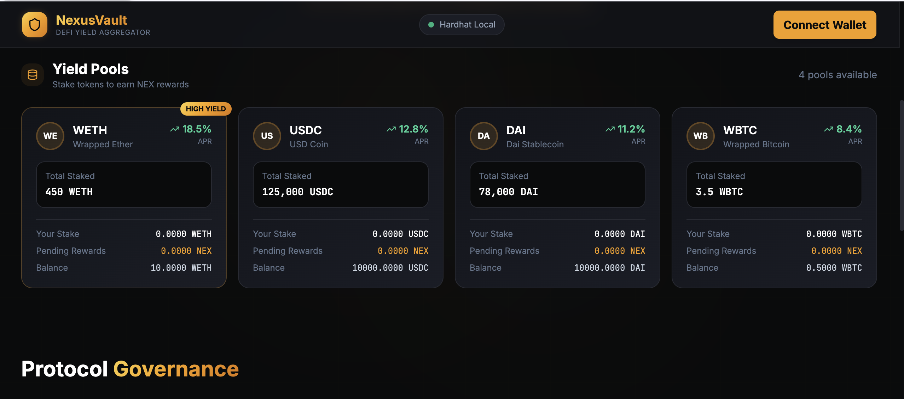
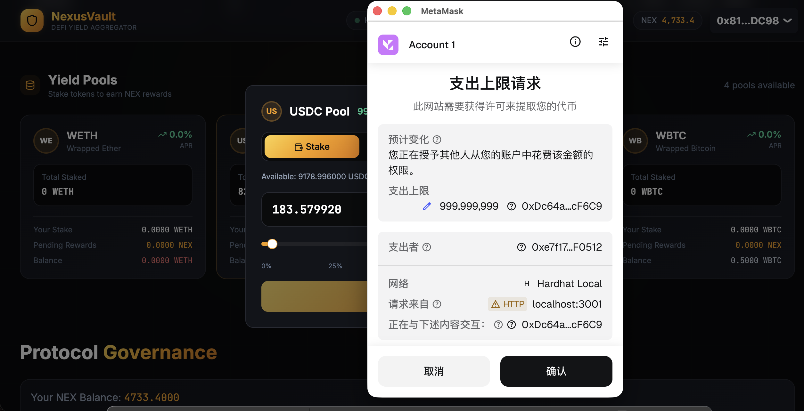
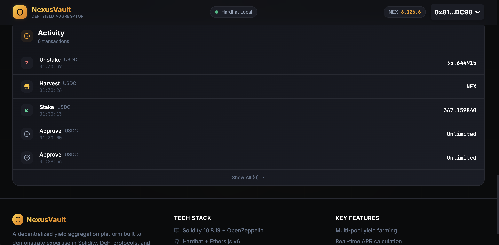

# NexusVault

<p align="center">
  
  
  
  
  
  
</p>

<p align="center">
  <b>Full-Stack DeFi Yield Aggregator</b><br/>
  Multi-pool staking, NEX reward token, on-chain governance, and yield boost mechanics
</p>

---

## Table of Contents

- [Overview](#overview)
- [Screenshots](#screenshots)
- [Architecture](#architecture)
- [Smart Contracts](#smart-contracts)
- [Features](#features)
- [Quick Start](#quick-start)
- [Contract Addresses](#contract-addresses)
- [Tech Stack](#tech-stack)
- [Project Structure](#project-structure)
- [Testing](#testing)
- [Security Considerations](#security-considerations)
- [Roadmap to Production](#roadmap-to-production)
- [License](#license)

---

## Overview

NexusVault is a **complete full-stack DeFi yield farming protocol** built from scratch. It demonstrates end-to-end Web3 development skills: designing Solidity contracts with security best practices, building a responsive React frontend, and wiring everything together with modern Web3 tooling (RainbowKit, Wagmi, viem).

**Key capabilities:**
- Stake ERC-20 tokens (WETH, USDC, DAI, WBTC) into yield pools
- Earn **NEX** governance tokens as rewards (proportional to stake amount & pool allocation)
- **NEX Boost** — holding NEX increases your effective APR (up to 2x)
- **Governance** — vote on protocol proposals with NEX-weighted voting power
- Fully functional on local Hardhat network with real on-chain transactions

> **Note:** This is a **portfolio-grade demonstration project**. It showcases production-quality code patterns but has **not been security audited** and should not be deployed to mainnet without professional review.

---

## Screenshots

> screenshots here after running the app_

| Dashboard | Staking Modal | Governance |
|-----------|--------------|------------|
|  |  |  |

---

## Architecture

```
┌─────────────────────────────────────────────────────────────┐
│                     React Frontend                         │
│  ┌─────────┐ ┌──────────┐ ┌────────────┐ ┌─────────────┐  │
│  │ Header  │ │  Pools   │ │ Governance │ │ Tx History  │  │
│  │(NEX bal)│ │(Stake/   │ │ (Voting)   │ │ (Activity)  │  │
│  │(Boost)  │ │ Harvest) │ │            │ │             │  │
│  └────┬────┘ └────┬─────┘ └─────┬──────┘ └──────┬──────┘  │
│       └─────────────┴─────────────┴───────────────┘          │
│                         │                                    │
│                    Wagmi + RainbowKit                        │
│                    (Wallet + Contract Calls)                 │
└─────────────────────────┬────────────────────────────────────┘
                          │ JSON-RPC
┌─────────────────────────┴────────────────────────────────────┐
│                  Hardhat Local Network (31337)               │
│                                                              │
│  ┌──────────────┐  ┌──────────┐  ┌─────────────────────┐   │
│  │ NexusVault   │  │NexusToken│  │ MockERC20 x4        │   │
│  │ (MasterChef  │  │ (NEX)    │  │ WETH/USDC/DAI/WBTC  │   │
│  │  style farm) │  │          │  │ + faucet()          │   │
│  └──────────────┘  └──────────┘  └─────────────────────┘   │
└─────────────────────────────────────────────────────────────┘
```

---

## Smart Contracts

### NexusVault.sol
Core yield farming contract inspired by MasterChef architecture:
- **Multi-pool support** — each pool has independent `allocPoint` controlling reward share
- **Per-block reward** — `nexPerBlock` minted and distributed proportionally
- **Deposit / Withdraw / Harvest** — standard yield farming lifecycle
- **Emergency withdraw** — allows withdrawal with 1% penalty during emergencies
- **Security:** `ReentrancyGuard`, `Pausable`, `Ownable`, `SafeERC20`

### NexusToken.sol
ERC-20 governance and reward token:
- **Controlled minting** — only authorized minters (Vault contract) can mint
- **Max supply cap** — 10,000,000 NEX hard cap
- **Burn** — holders can burn NEX to reduce supply

### MockERC20.sol
Test tokens for local development:
- **Built-in faucet** — `faucet()` mints test tokens to caller
- 4 instances: WETH, USDC, DAI, WBTC (with correct decimals)

---

## Features

### Yield Farming
- Stake WETH, USDC, DAI, or WBTC into dedicated pools
- Each pool has different base APR based on allocation points
- Harvest NEX rewards at any time
- Unstake to reclaim principal + pending rewards

### NEX Boost Multiplier
| NEX Held | Tier | Multiplier |
|----------|------|------------|
| 0 - 100 | None | 1.0x |
| 100 - 1,000 | Bronze | 1.1x |
| 1,000 - 5,000 | Silver | 1.25x |
| 5,000 - 20,000 | Gold | 1.5x |
| 20,000+ | Platinum | 2.0x |

Holding NEX increases your **effective APR** on all pools. Displayed in real-time on pool cards and header.

### Governance
- View active and historical protocol proposals
- Vote For/Against with NEX-weighted voting power (1 NEX = 1 vote)
- Vote progress bars with real-time percentages
- Simulated proposals for demonstration (voting is frontend-only in this version)

### Demo Mode
When not connected to Hardhat Localhost, the app runs in **Demo Mode** with simulated balances and transactions, allowing UI exploration without a local blockchain.

---

## Quick Start

### Prerequisites
- [Node.js](https://nodejs.org/) 18+
- [MetaMask](https://metamask.io/) browser extension

### 1. Install Dependencies

```bash
# Frontend dependencies
npm install

# Hardhat dependencies (separate package.json)
cd hardhat && npm install
cd ..
```

### 2. Start Hardhat Local Blockchain

```bash
cd hardhat
npx hardhat node
```

Chain runs at `http://127.0.0.1:8545` (Chain ID: 31337).

### 3. Deploy Contracts

```bash
# In a new terminal, from the hardhat/ directory
npx hardhat run scripts/deploy.js --network localhost
```

Deploys Vault, NEX Token, 4 mock tokens, and creates 4 yield pools. Deployment addresses are automatically written to `src/config/contracts.ts`.

### 4. Configure MetaMask

1. Open MetaMask → Settings → Networks → Add Network
2. Fill in:
   - **Network Name:** Hardhat Local
   - **RPC URL:** `http://127.0.0.1:8545`
   - **Chain ID:** `31337`
   - **Currency Symbol:** ETH
3. Save

### 5. Import Test Account

1. MetaMask → Account icon → Import Account
2. Paste private key: `0xac0974bec39a17e36ba4a6b4d238ff944bacb478cbed5efcae784d7bf4f2ff80`
3. You should see ~10,000 ETH

### 6. Run Frontend

```bash
# From project root
npm run dev
```

Open [http://localhost:3000](http://localhost:3000)

### 7. Use the DApp

1. Click **"Connect Wallet"** → Select MetaMask
2. Ensure you're on **Hardhat Local** network
3. Click any pool card → **"Get Free [Token]"** to get test tokens
4. Enter amount → **"Approve"** → **"Stake"**
5. Wait a few blocks (Hardhat auto-mines every 3s)
6. **"Harvest"** to claim NEX rewards
7. Watch your NEX balance appear in the header with boost tier

---

## Contract Addresses (Hardhat Local)

After deployment, contracts have deterministic addresses on Hardhat:

| Contract | Address |
|----------|---------|
| **NexusVault** | `0xe7f1725E7734CE288F8367e1Bb143E90bb3F0512` |
| **NEX Token** | `0x5FbDB2315678afecb367f032d93F642f64180aa3` |
| **WETH** | `0xCf7Ed3AccA5a467e9e704C703E8D87F634fB0Fc9` |
| **USDC** | `0xDc64a140Aa3E981100a9becA4E685f962f0cF6C9` |
| **DAI** | `0x5FC8d32690cc91D4c39d9d3abcBD16989F875707` |
| **WBTC** | `0x0165878A594ca255338adfa4d48449f69242Eb8F` |

> These addresses are automatically configured in `src/config/contracts.ts` after deployment.

---

## Tech Stack

| Layer | Technology |
|-------|-----------|
| Smart Contracts | Solidity ^0.8.20, OpenZeppelin v5 |
| Local Blockchain | Hardhat, Ethers.js v6 |
| Frontend | React 18, TypeScript, Vite |
| Styling | Tailwind CSS, shadcn/ui |
| Web3 Integration | RainbowKit, Wagmi v2, viem |
| Animation | Framer Motion |
| Icons | Lucide React |

---

## Project Structure

```
├── hardhat/                      # Hardhat environment
│   ├── contracts/                # Solidity contracts
│   │   ├── NexusVault.sol        # Main farming contract
│   │   ├── NexusToken.sol        # NEX governance token
│   │   └── MockERC20.sol         # Test tokens with faucet
│   ├── scripts/
│   │   └── deploy.js             # Auto-deploy + write addresses
│   ├── hardhat.config.js         # Network config (auto-mining 3s)
│   └── package.json              # Separate deps for Hardhat
│
├── src/
│   ├── components/               # React UI components
│   │   ├── Header.tsx            # Nav + NEX balance + boost tier
│   │   ├── HeroSection.tsx       # Stats dashboard
│   │   ├── PoolList.tsx          # Pool grid container
│   │   ├── PoolCard.tsx          # Individual pool card + stake modal
│   │   ├── GovernanceSection.tsx # Proposals + voting
│   │   ├── ContractShowcase.tsx  # Contract code display
│   │   ├── TxHistory.tsx         # Recent transaction log
│   │   └── ui/                   # shadcn/ui primitives
│   ├── hooks/
│   │   └── VaultContext.tsx      # Core Web3 state (balances, boosts, txs)
│   ├── abi/                      # Contract JSON ABIs
│   ├── config/
│   │   ├── contracts.ts          # Contract addresses + token colors
│   │   └── wagmi.ts              # Wagmi/RainbowKit config
│   ├── types/                    # TypeScript interfaces
│   ├── App.tsx                   # Root layout
│   └── main.tsx                  # Providers setup
│
├── vite.config.ts                # Vite + path aliases
├── tailwind.config.js            # Custom theme + gradients
├── tsconfig.json
└── package.json
```

---

## Testing

### Contract Tests

```bash
cd hardhat
npx hardhat test
```

Tests cover:
- Pool creation and allocation configuration
- Deposit and per-block reward accrual
- Harvest (claim NEX rewards)
- Withdrawal (principal returned)
- Emergency withdraw (with 1% fee)
- Pause/unpause
- Reentrancy protection

### Frontend Type Check

```bash
npx tsc --noEmit
```

---

## Security Considerations

This project demonstrates security-conscious patterns but **has not been formally audited**:

| Feature | Status |
|---------|--------|
| ReentrancyGuard (OpenZeppelin) | Implemented |
| SafeERC20 token transfers | Implemented |
| Pausable emergency stop | Implemented |
| Ownable access control | Implemented |
| Max supply cap (NEX) | Implemented |
| Controlled minter roles | Implemented |
| Professional security audit | **Not done** |
| Formal verification | **Not done** |
| Bug bounty program | **Not done** |

> **Do not deploy to mainnet or handle real funds without a professional audit.**

---

## Roadmap to Production

This project is a **MVP / portfolio demonstration**. To reach production:

1. **Security audit** — Engage OpenZeppelin, CertiK, or SlowMist
2. **Testnet deployment** — Deploy to Sepolia for public beta testing
3. **Governance on-chain** — Integrate OpenZeppelin Governor or Snapshot
4. **Price oracle** — Replace hardcoded prices with Chainlink Price Feeds
5. **Multi-sig admin** — Transfer ownership from EOA to Gnosis Safe
6. **Frontend hardening** — Error boundaries, retry logic, gas estimation
7. **Monitoring** — Contract event indexing (The Graph), alerting
8. **Documentation** — API docs, user guides, security policy

---

## License

MIT

---

<p align="center">
  Built with Solidity, React, and coffee.
</p>
